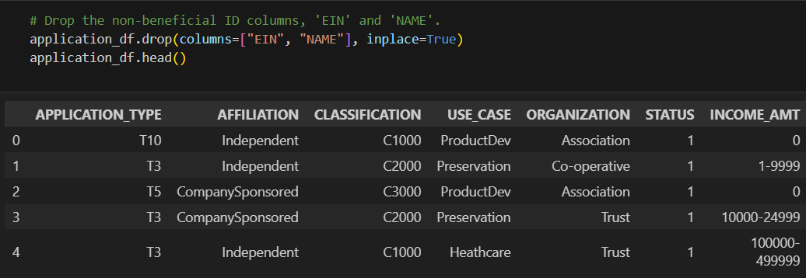
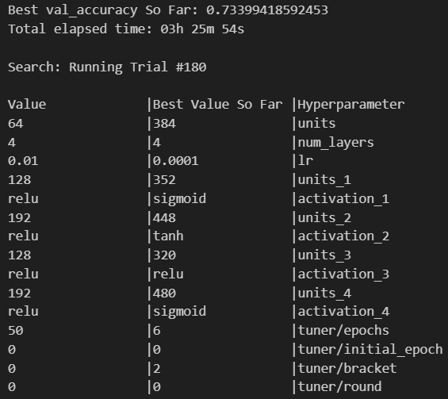

# Charity Prediction Analysis

Note: main code file is named "CharityDataPrediction.ipynb" in the root directory and its associated model is located in the "first_model" directory with the file name "AlphabetSoupCharity.h5." The other code file that was used to optimize in Collab is named "AlphabetSoupCharity_Optimization.ipynb" located in the "googleCollab" directory and its associated model is named "bestModel.h5" located in the best_model directory.

Overview of the analysis: The purpose of the analysis is to create a model that predict whether a charity will be successful by features such as organizations, ask amount, and income amount, etc.

<h2>Data Preprocessing</h2>
<ul>
    <li> What variable(s) are the target(s) for your model? The target variable is whether a charity will be sucessful.</li>
    <li> What variable(s) are the features for your model? The features are the application_type, affiliation, use_case, organization, status, income_amt, special_considerations, and ask_amt.</li>
    <li>What variable(s) should be removed from the input data because they are neither targets nor features? The EIN and NAME columns were removed because they are neither targets nor features.</li>
    </img>
</ul>

<h2>Compiling, Training, and Evaluating the Model</h2>
<ul>
    <li>How many neurons, layers, and activation functions did you select for your neural network model, and why? I used 6 layers, each with about 400 units and used sigmoid, tanh, and relu for their activation functions because these combinations have the highest validation accuracy.</li>
    </img>
    <li>Were you able to achieve the target model performance? I was unable to achieve the target accuracy of 75%. The highest validation accuracy I was able to obtain was 73%.</li>
    <li>What steps did you take in your attempts to increase model performance? To increase my model performance, I tried to tune my parameters using Keras's HyperBand module. I tested across different activation function across different hidden layers, different number of hidden layers, learning rate, number of units, and adding regularization with dropout.</li>
</ul>

<h2>Summary:</h2>
<ul>
    <li>Overall, the model achieved a peak performance of 73% validation accuracy, which is very good for the sake of classification. However, the model is not good for consulting because the explainability is low; it is near impossible to explain to clients why the model predicts a charity is successful or not. Instead, to increase more explainability, we may want to use an algorithmic ML model such as decision trees and random forests that classify based on each input feature, so we can tell exactly why a model decides a classification and be able to communicate with our clients. </li>
</ul>
